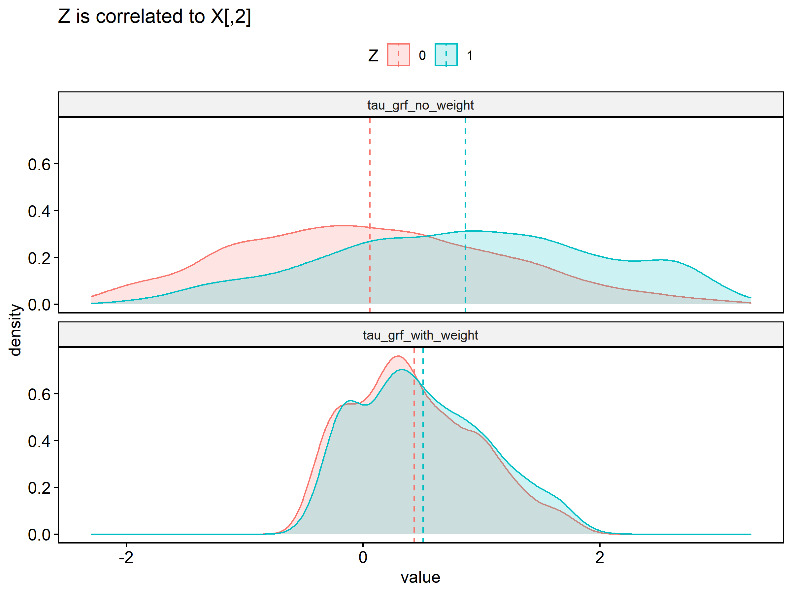
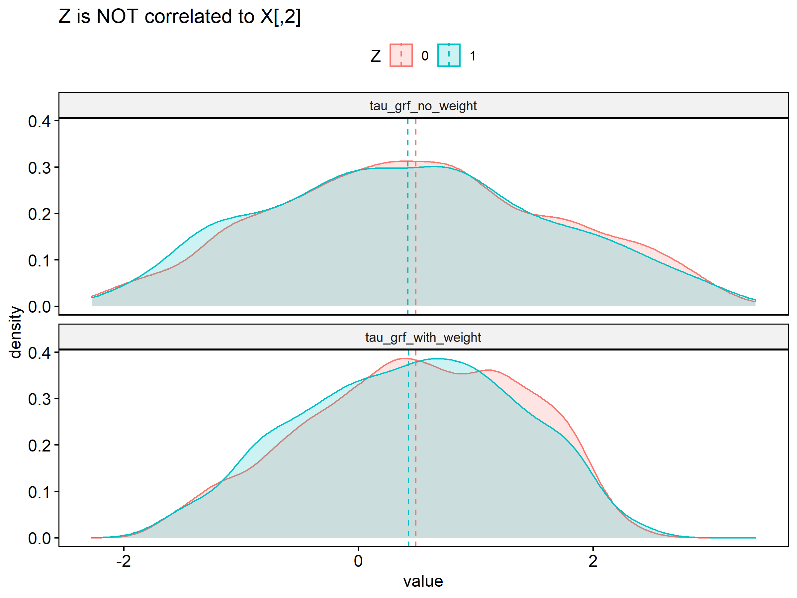

# generalized random forests <a href='https://grf-labs.github.io/grf/'></a>

Forked from [https://github.com/grf-labs/grf](https://github.com/grf-labs/grf)

## Installation

This package is not available on CRAN and must be built from source. On Windows you will
need RTools from https://cran.r-project.org/bin/windows/Rtools/ and on OS X you will 
need the developer tools documented in https://mac.r-project.org/tools/.

First install the `devtools` package, then use it to install `beat`:

```R
install.packages(c("devtools", "ggplot2")) ## ggplot2 only needed for example
devtools::install_version("RcppEigen", "0.3.3.7.0") ## beat does not work with newer RcppEigen
devtools::install_github("ayeletis/beat")  ## do not update any packages if prompted
```

## Sample Usage

```R
library(beat)
library(ggplot2)


## ----------------------------------------------
##   Simulate some data
## ----------------------------------------------

n1 = 1000; #calibration 
n2 = 1000; #validation
p_continuous = 4  # number of continuous features (unprotected)
p_discrete = 3  # number of discrete features (unprotected)
p_demog = 1 # number of protected attributes
n = n1 + n2

                                        # Features (unprotected)
X_cont = matrix(rnorm(n*p_continuous), n, p_continuous)
X_disc = matrix(rbinom(n*p_discrete, 1, 0.3),n,p_discrete)
X = cbind(X_cont,X_disc)

                                        # Protected attributes, discrete and continuous, where the first one is correlated with X[,2]
Z = rbinom(n, 1, 1/(1+exp(-X_cont[,2])))

                                        # Tau -- in this example in depends on X[2] but no on Z
tau <- (-1 + pmax(X[,1], 0) + X[,2] + abs(X[,3]) + X[,5]) 

                                        # Random assignment
W = rbinom(n, 1, 0.5)

                                        # Output for causal forest
Y =  X[,1] - 2*X[,2] + X[,4] + 3*Z + tau*W + runif(n)   # Y is function of X, Z(demo), tau*W

train_data = data.frame(Y=Y[c(1:n1)], Z=Z[c(1:n1)], W=W[c(1:n1)], X=X[c(1:n1),], tau = tau[c(1:n1)])
test_data = data.frame(Y=Y[c((n1+1):(n1+n2))], Z=Z[c((n1+1):(n1+n2))], W=W[c((n1+1):(n1+n2))], X=X[c((n1+1):(n1+n2)),], tau = tau[c((n1+1):(n1+n2))])

Xcols = grep("X", names(train_data), value=TRUE)
Zcols =grep('Z', names(train_data), value=TRUE)


## train
X_train = train_data[,c(4:10)]
Y_train = train_data$Y
W_train = train_data$W
Z_train = train_data[,2]

## test
X_test = test_data[,c(4:10)]
Z_test = test_data$Z

## model specs
num_trees = 2000
my_penalty = 10 # When penalty = 0 it corresponds to GRF

## ----------------------------------------------
##   Estimate Balanced Causal Forest 
## ----------------------------------------------
fit_causal_beat <- balanced_causal_forest(X_train, Y_train, W_train,
                                          target.weights = as.matrix(Z_train),
                                          target.weight.penalty = my_penalty,
                                          num.trees = num_trees)


## Predict CBT causal scores
cbt_causal_train = predict(fit_causal_beat)$predictions
cbt_causal_test = predict(fit_causal_beat, X_test)$predictions


## ----------------------------------------------
##   Estimate Balanced Probability Forest 
## ----------------------------------------------
fit_regression_beat <- balanced_regression_forest(X_train, Y_train,
                                                  target.weights = as.matrix(Z_train),
                                                  target.weight.penalty = my_penalty,
                                                  num.trees = num_trees)

## Predict CBT regression scores
cbt_regression_train = predict(fit_regression_beat)$predictions
cbt_regression_test = predict(fit_regression_beat, X_test)$predictions


## ----------------------------------------------
##   Check balance in test scores
## ----------------------------------------------
dat.plot = data.frame(cbt_causal = cbt_causal_test,
                      cbt_regr = cbt_regression_test,
                      Z = as.factor(Z_test))
ggplot(data=dat.plot,
       aes(x=cbt_regr, color=Z, fill=Z)) +
    geom_density(alpha = 0.2)

```

## Targeting Policy
I write some functions for balanced sampling and greedy sampling. The script is [here](https://github.com/yu45020/grf/blob/master/r-package/grf/R/select_targets.R). 

## Highlights:
* Original package use symbolic links for all C++ codes, but Windows users may fail to build it from source. All C++ code locations are  re-arranged. 
* Add  target weight penalty in `regression_forest` and `causual forest`
* penalty is calculated as following:
   1. calculate average from all target weight, denoted as $V_{0}$;
   2. in the left node, denote number of samples as $N$,  denote average target weight from samples  as $V_{1}$; 
   3. add distribution penalty rate as $D * N*\frac{L_{2}Norm(V_{1}-V_{2})}{L_{2}Norm(V1) + L_{2}Norm(V2)}$.  
      - early splits usually have larger $N$ 
      - D is decrease in impurity
* Package version is changed to 1.2.1

## How Parameters Are Tuned: 
* generate a small number random number with uniform distribution on [0, 1] (`num.fit.reps`=50 * num parameters)
* generate values per parameter type (defined in `get_params_from_draw` in `tune.R` or check the code block below)
* use those parameter grid to fit a model with small size tree (`num.fit.trees`=200) and calculate de-biased error
* fit a Kriging model to predict expected error from a larger parameter grid (`num.optimize.reps`=1000 * num parameters)
* pick the parameter set by the lowest error and refit a tree to get actual error
* pick the best set from default parameter, user parameter, and tuned parameters by the lowest error value. 
* (The original package ignore user input parameters as it compares the tuned against default set)

### A Very Brief Explanation on Kriging model:
Suppose we want to do a parameter grid search. The computation burden becomes large when the number of parameters and values are large. 10 parameters and 100 values each will results in fitting 1000 models. To speed up the process, we first use a small size parameter grid and use the model error to fit a model that predicts the expected error for larger set of parameters. 

The Kriging model assumes the based on a set of parameter, the distribution of true model error conditioned on predicted error is normal, and the mean and variance depend on the parameter set. This method requires to center Y and X, so in `causal_forest` Y and W are centered before running causal analysis.

Reference:
>[Olivier Roustant, David Ginsbourger, Yves Deville.  DiceKriging, DiceOptim:  Two R packages forthe analysis of computer experiments by kriging-based metamodeling and optimization. 2010. ￿hal-00495766v2](https://hal.archives-ouvertes.fr/file/index/docid/499475/filename/DiceJSS.pdf)


## Definition of Parameter Grid

```R
default.parameters <- list(sample.fraction = 0.5,
                             mtry = min(ceiling(sqrt(ncol(X)) + 20), ncol(X)),
                             min.node.size = 5,
                             honesty.fraction = 0.5,
                             honesty.prune.leaves = TRUE,
                             alpha = 0.05,
                             imbalance.penalty = 0,
                             target.weight.penalty=0)
```

 ```R
  get_params_from_draw <- function(nrow.X, ncol.X, draws) {
    # draw is a vector of tunable parameter names
  if (is.vector(draws)) {
    draws <- rbind(c(draws))
  }
  n <- nrow(draws)
  vapply(colnames(draws), function(param) {
    if (param == "min.node.size") {
      return(floor(2^(draws[, param] * (log(nrow.X) / log(2) - 4))))
    } else if (param == "sample.fraction") {
      return(0.05 + 0.45 * draws[, param])
    } else if (param == "mtry") {
      return(ceiling(min(ncol.X, sqrt(ncol.X) + 20) * draws[, param]))
    } else if (param == "alpha") {
      return(draws[, param] / 4)
    } else if (param == "imbalance.penalty") {
      return(-log(draws[, param]))
    } else if (param == "honesty.fraction") {
      return(0.5 + (0.8 - 0.5) * draws[, param]) # honesty.fraction in U(0.5, 0.8)
    } else if (param == "honesty.prune.leaves") {
      return(ifelse(draws[, param] < 0.5, TRUE, FALSE))
    } else if (param=='target.weight.penalty') {
      return(pmin(gamma(draws[,param]), 100)) # [0, 100]
    }else {
      stop("Unrecognized parameter name provided: ", param)
    }
  }, FUN.VALUE = numeric(n))}
  ```

## Files Change Log
```
R/balanced_casual_forest.R
R/balanced_regression_forest.R
R/tuning_balanced.R
R/tune_casual_forest.R
R/tune_regression_forest.R
R/input_utilities.R
R/print.R
src/BalancedCausalForestBindings.cpp
src/BalancedRegressionForestBindings.cpp
src/forest/ForestTrainers.h
src/forest/ForestTrainers.cpp
src/splitting/factory/BalancedRegressionSplittingRuleFactory.h
src/splitting/factory/BalancedRegressionSplittingRuleFactory.cpp
src/splitting/factory/BalancedInstrumentalSplittingRulesFactory.h
src/splitting/factory/BalancedInstrumentalSplittingRulesFactory.cpp
src/splitting/BalancedRegressionSplittingRule.h
src/splitting/BalancedRegressionSplittingRule.cpp
src/splitting/BalancedInstrumentalSplittingRules.h
src/splitting/BalancedInstrumentalSplittingRules.cpp
src/commons/Data.cpp
src/commons/Data.h

```


--

[Sample usage](r-package/grf/tests/causual_forest_test.R)

### Results:


If Z is independent from X 


 
