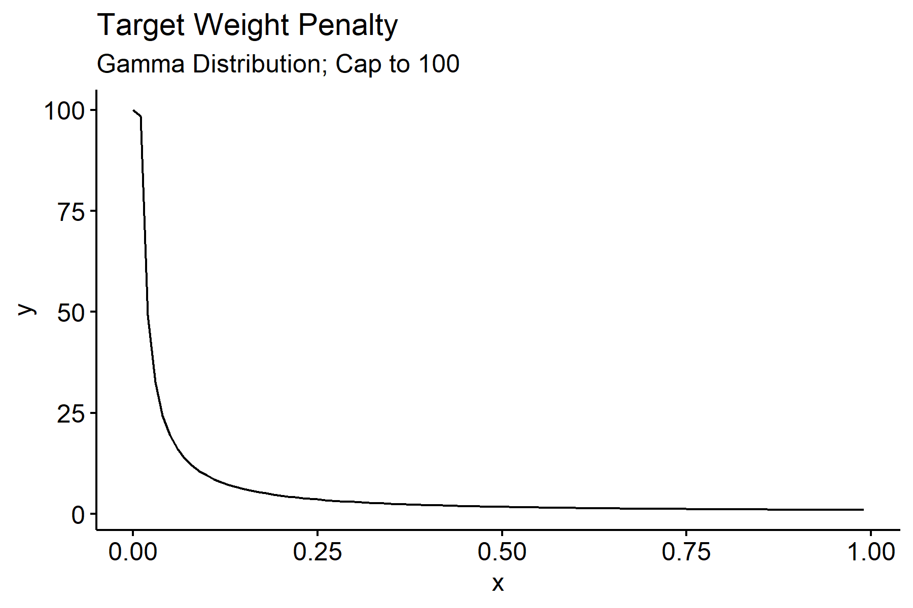
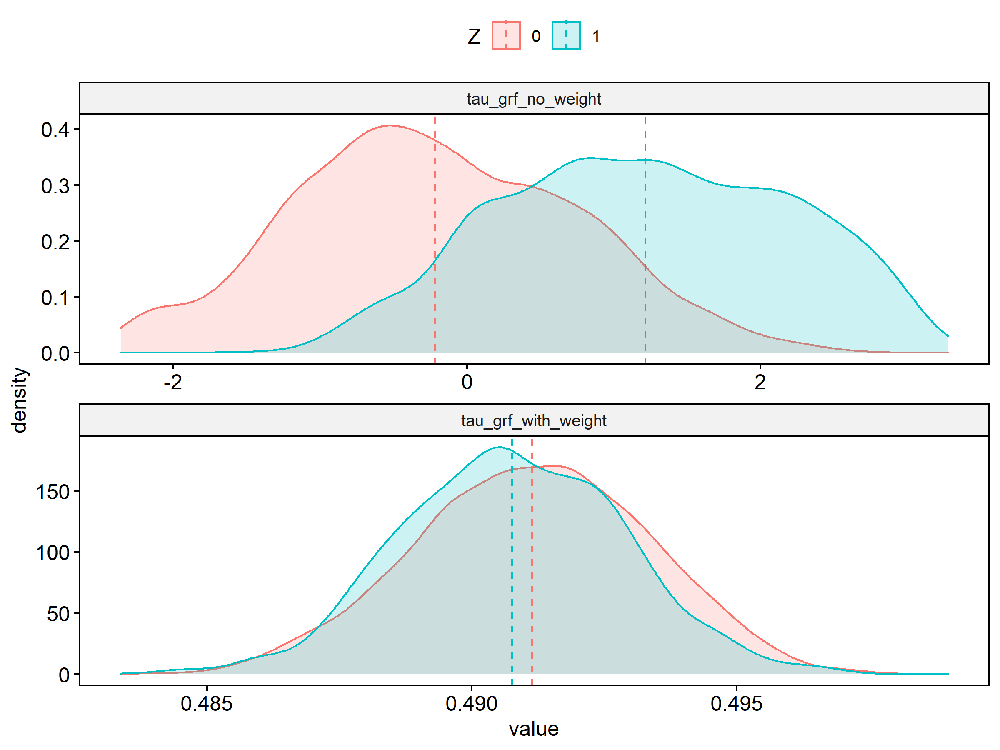

# generalized random forests <a href='https://grf-labs.github.io/grf/'></a>

Fork from [https://github.com/grf-labs/grf](https://github.com/grf-labs/grf)
## Highlights:
* Original package use symbolic links for all C++ codes, but Windows users may fail to build it from source. All C++ code locations are  re-arranged. 
* Add  target weight penalty in `regression_forest` and `causual forest`
* penalty is calculated as following:
   1. calculate average from all target weight, denoted as $V_{0}$;
   2. in the left node, denote number of samples as $N$,  denote average target weight from samples  as $V_{1}$; 
   3. add distribution penalty rate as $D * N*\frac{L_{2}Norm(V_{1}-V_{2})}{L_{2}Norm(V1) + L_{2}Norm(V2)}$.  
      - early splits usually have larger $N$ 
      - D is decrease in impurity
* Package version is changed to 1.2.1

## How Parameters Are Tuned: 
* generate a small number random number with uniform distribution on [0, 1] (`num.fit.reps`=50 * num parameters)
* generate values per parameter type (defined in `get_params_from_draw` in `tune.R` or check the code block below)
* use those parameter grid to fit a model with small size tree (`num.fit.trees`=200) and calculate de-biased error
* fit a Kriging model to predict expected error from a larger parameter grid (`num.optimize.reps`=1000 * num parameters)
* pick the parameter set by the lowest error and refit a tree to get actual error
* pick the best set from default parameter, user parameter, and tuned parameters by the lowest error value. 
* (The original package ignore user input parameters as it compares the tuned against default set)

### A Very Brief Explanation on Kriging model:
Suppose we want to do a parameter grid search. The computation burden becomes large when the number of parameters and values are large. 10 parameters and 100 values each will results in fitting 1000 models. To speed up the process, we first use a small size parameter grid and use the model error to fit a model that predicts the expected error for larger set of parameters. 

The Kriging model assumes the based on a set of parameter, the distribution of true model error conditioned on predicted error is normal, and the mean and variance depend on the parameter set. This method requires to center Y and X, so in `causal_forest` Y and W are centered before running causal analysis.

Reference:
>[Olivier Roustant, David Ginsbourger, Yves Deville.  DiceKriging, DiceOptim:  Two R packages forthe analysis of computer experiments by kriging-based metamodeling and optimization. 2010. ￿hal-00495766v2](https://hal.archives-ouvertes.fr/file/index/docid/499475/filename/DiceJSS.pdf)


## Definition of Parameter Grid

```R
default.parameters <- list(sample.fraction = 0.5,
                             mtry = min(ceiling(sqrt(ncol(X)) + 20), ncol(X)),
                             min.node.size = 5,
                             honesty.fraction = 0.5,
                             honesty.prune.leaves = TRUE,
                             alpha = 0.05,
                             imbalance.penalty = 0,
                             target.weight.penalty=0)
```

 ```R
  get_params_from_draw <- function(nrow.X, ncol.X, draws) {
    # draw is a vector of tunable parameter names
  if (is.vector(draws)) {
    draws <- rbind(c(draws))
  }
  n <- nrow(draws)
  vapply(colnames(draws), function(param) {
    if (param == "min.node.size") {
      return(floor(2^(draws[, param] * (log(nrow.X) / log(2) - 4))))
    } else if (param == "sample.fraction") {
      return(0.05 + 0.45 * draws[, param])
    } else if (param == "mtry") {
      return(ceiling(min(ncol.X, sqrt(ncol.X) + 20) * draws[, param]))
    } else if (param == "alpha") {
      return(draws[, param] / 4)
    } else if (param == "imbalance.penalty") {
      return(-log(draws[, param]))
    } else if (param == "honesty.fraction") {
      return(0.5 + (0.8 - 0.5) * draws[, param]) # honesty.fraction in U(0.5, 0.8)
    } else if (param == "honesty.prune.leaves") {
      return(ifelse(draws[, param] < 0.5, TRUE, FALSE))
    } else if (param=='target.weight.penalty') {
      return(pmin(gamma(draws[,param]), 100)) # [0, 100]
    }else {
      stop("Unrecognized parameter name provided: ", param)
    }
  }, FUN.VALUE = numeric(n))}
  ```


### Distribution of target weight penalty.
X is uniformly distributed from [0, 1]

  

## Files Change Log
```
R/balanced_casual_forest.R
R/balanced_regression_forest.R
R/tuning_balanced.R
R/tune_casual_forest.R
R/tune_regression_forest.R
R/input_utilities.R
src/BalancedCausalForestBindings.cpp
src/BalancedRegressionForestBindings.cpp
src/forest/ForestTrainers.h
src/forest/ForestTrainers.cpp
src/splitting/factory/BalancedRegressionSplittingRuleFactory.h
src/splitting/factory/BalancedRegressionSplittingRuleFactory.cpp
src/splitting/factory/BalancedInstrumentalSplittingRulesFactory.h
src/splitting/factory/BalancedInstrumentalSplittingRulesFactory.cpp
src/splitting/BalancedRegressionSplittingRule.h
src/splitting/BalancedRegressionSplittingRule.cpp
src/splitting/BalancedInstrumentalSplittingRules.h
src/splitting/BalancedInstrumentalSplittingRules.cpp
src/commons/Data.cpp
src/commons/Data.h

```

## Potential Problems:
* Curse of dimensionality?
  - Euclidean distance is bad when the dimension of target weight is large.
  - But increasing dimensions of target weight to 50 seems have no impact.
* Need to figure out when causal forest use instrument or regression splitting rules.
## Build From Source:

Update Local Repo ( in the Repo root folder)

This method may speed up build time as not all files are recompiled. 
```
git fetch --all 
```
Or you may double click grf/r-package/grf/grf.Rproj --> Tools --> Version Control--> Pull Branches

Click Build --> Install and Restart


Clean Build and all files are compiled. 
```
git clone https://github.com/yu45020/grf
cd grf/r-package/grf
Use Rstudio to open it as a project. Or double click 'grf.Rproj'
Click Build --> Install and Restart
```

--

[Sample usage](r-package/grf/tests/causual_forest_test.R)

### Results:


If Z is independent from X 


If Z has 50 dimensions and plot the first dimension



Original ReadME
-----

[](https://cran.r-project.org/package=grf)

[](https://travis-ci.com/grf-labs/grf)

A pluggable package for forest-based statistical estimation and inference. GRF currently provides non-parametric methods for least-squares regression, quantile regression, survival regression, and treatment effect estimation (optionally using instrumental variables), with support for missing values.

In addition, GRF supports 'honest' estimation (where one subset of the data is used for choosing splits, and another for populating the leaves of the tree), and confidence intervals for least-squares regression and treatment effect estimation.

Some helpful links for getting started:

- The [R package documentation](https://grf-labs.github.io/grf) contains usage examples and method reference.
- The [GRF reference](https://grf-labs.github.io/grf/REFERENCE.html) gives a detailed description of the GRF algorithm and includes troubleshooting suggestions.
- For community questions and answers around usage, see [Github issues labelled 'question'](https://github.com/grf-labs/grf/issues?q=label%3Aquestion).

The repository first started as a fork of the [ranger](https://github.com/imbs-hl/ranger) repository -- we owe a great deal of thanks to the ranger authors for their useful and free package.

### Installation

The latest release of the package can be installed through CRAN:

```R
install.packages("grf")
```

`conda` users can install from the [conda-forge](https://anaconda.org/conda-forge/r-grf) channel:

```
conda install -c conda-forge r-grf
```

The current development version can be installed from source using devtools.

```R
devtools::install_github("grf-labs/grf", subdir = "r-package/grf")
```

Note that to install from source, a compiler that implements C++11 is required (clang 3.3 or higher, or g++ 4.8 or higher). If installing on Windows, the RTools toolchain is also required.

### Usage Examples

The following script demonstrates how to use GRF for heterogeneous treatment effect estimation. For examples
of how to use types of forest, as for quantile regression and causal effect estimation using instrumental
variables, please consult the R [documentation](https://grf-labs.github.io/grf/reference/index.html) on the relevant forest methods (quantile_forest, instrumental_forest, etc.).

```R
library(grf)

# Generate data.
n <- 2000
p <- 10
X <- matrix(rnorm(n * p), n, p)
X.test <- matrix(0, 101, p)
X.test[, 1] <- seq(-2, 2, length.out = 101)

# Train a causal forest.
W <- rbinom(n, 1, 0.4 + 0.2 * (X[, 1] > 0))
Y <- pmax(X[, 1], 0) * W + X[, 2] + pmin(X[, 3], 0) + rnorm(n)
tau.forest <- causal_forest(X, Y, W)

# Estimate treatment effects for the training data using out-of-bag prediction.
tau.hat.oob <- predict(tau.forest)
hist(tau.hat.oob$predictions)

# Estimate treatment effects for the test sample.
tau.hat <- predict(tau.forest, X.test)
plot(X.test[, 1], tau.hat$predictions, ylim = range(tau.hat$predictions, 0, 2), xlab = "x", ylab = "tau", type = "l")
lines(X.test[, 1], pmax(0, X.test[, 1]), col = 2, lty = 2)

# Estimate the conditional average treatment effect on the full sample (CATE).
average_treatment_effect(tau.forest, target.sample = "all")

# Estimate the conditional average treatment effect on the treated sample (CATT).
# Here, we don't expect much difference between the CATE and the CATT, since
# treatment assignment was randomized.
average_treatment_effect(tau.forest, target.sample = "treated")

# Add confidence intervals for heterogeneous treatment effects; growing more trees is now recommended.
tau.forest <- causal_forest(X, Y, W, num.trees = 4000)
tau.hat <- predict(tau.forest, X.test, estimate.variance = TRUE)
sigma.hat <- sqrt(tau.hat$variance.estimates)
plot(X.test[, 1], tau.hat$predictions, ylim = range(tau.hat$predictions + 1.96 * sigma.hat, tau.hat$predictions - 1.96 * sigma.hat, 0, 2), xlab = "x", ylab = "tau", type = "l")
lines(X.test[, 1], tau.hat$predictions + 1.96 * sigma.hat, col = 1, lty = 2)
lines(X.test[, 1], tau.hat$predictions - 1.96 * sigma.hat, col = 1, lty = 2)
lines(X.test[, 1], pmax(0, X.test[, 1]), col = 2, lty = 1)

# In some examples, pre-fitting models for Y and W separately may
# be helpful (e.g., if different models use different covariates).
# In some applications, one may even want to get Y.hat and W.hat
# using a completely different method (e.g., boosting).

# Generate new data.
n <- 4000
p <- 20
X <- matrix(rnorm(n * p), n, p)
TAU <- 1 / (1 + exp(-X[, 3]))
W <- rbinom(n, 1, 1 / (1 + exp(-X[, 1] - X[, 2])))
Y <- pmax(X[, 2] + X[, 3], 0) + rowMeans(X[, 4:6]) / 2 + W * TAU + rnorm(n)

forest.W <- regression_forest(X, W, tune.parameters = "all")
W.hat <- predict(forest.W)$predictions

forest.Y <- regression_forest(X, Y, tune.parameters = "all")
Y.hat <- predict(forest.Y)$predictions

forest.Y.varimp <- variable_importance(forest.Y)

# Note: Forests may have a hard time when trained on very few variables
# (e.g., ncol(X) = 1, 2, or 3). We recommend not being too aggressive
# in selection.
selected.vars <- which(forest.Y.varimp / mean(forest.Y.varimp) > 0.2)

tau.forest <- causal_forest(X[, selected.vars], Y, W,
                            W.hat = W.hat, Y.hat = Y.hat,
                            tune.parameters = "all")

# Check whether causal forest predictions are well calibrated.
test_calibration(tau.forest)
```

### Developing

In addition to providing out-of-the-box forests for quantile regression and causal effect estimation, GRF provides a framework for creating forests tailored to new statistical tasks. If you'd like to develop using GRF, please consult the [algorithm reference](https://grf-labs.github.io/grf/REFERENCE.html) and [development guide](https://grf-labs.github.io/grf/DEVELOPING.html).

### Funding

Development of GRF is supported by the National Science Foundation, the Sloan Foundation, the Office of Naval Research (Grant N00014-17-1-2131) and Schmidt Futures.

### References

Susan Athey and Stefan Wager.
<b>Estimating Treatment Effects with Causal Forests: An Application.</b>
<i>Observational Studies</i>, 5, 2019.
[<a href="https://obsstudies.org/wp-content/uploads/2019/09/all-papers-compiled.pdf">paper</a>,
<a href="https://arxiv.org/abs/1902.07409">arxiv</a>]

Susan Athey, Julie Tibshirani and Stefan Wager.
<b>Generalized Random Forests.</b> <i>Annals of Statistics</i>, 47(2), 2019.
[<a href="https://projecteuclid.org/euclid.aos/1547197251">paper</a>,
<a href="https://arxiv.org/abs/1610.01271">arxiv</a>]

Rina Friedberg, Julie Tibshirani, Susan Athey, and Stefan Wager.
<b>Local Linear Forests.</b> 2018.
[<a href="https://arxiv.org/abs/1807.11408">arxiv</a>]

Imke Mayer, Erik Sverdrup, Tobias Gauss, Jean-Denis Moyer, Stefan Wager and Julie Josse.
<b>Doubly Robust Treatment Effect Estimation with Missing Attributes.</b>
<i>Annals of Applied Statistics</i>, forthcoming.
[<a href="https://arxiv.org/pdf/1910.10624.pdf">arxiv</a>]

Stefan Wager and Susan Athey.
<b>Estimation and Inference of Heterogeneous Treatment Effects using Random Forests.</b>
<i>Journal of the American Statistical Association</i>, 113(523), 2018.
[<a href="https://www.tandfonline.com/eprint/v7p66PsDhHCYiPafTJwC/full">paper</a>,
<a href="http://arxiv.org/abs/1510.04342">arxiv</a>]
