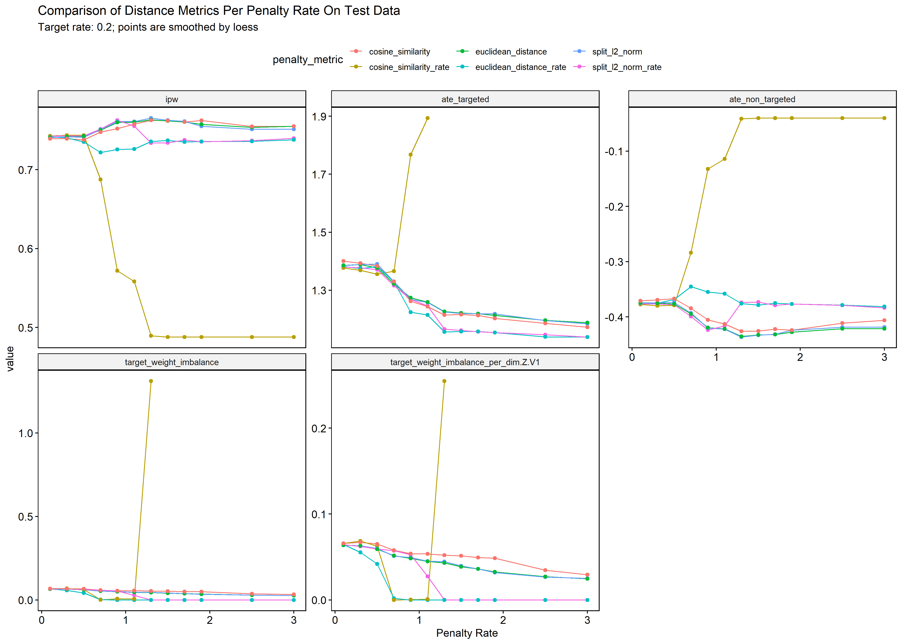
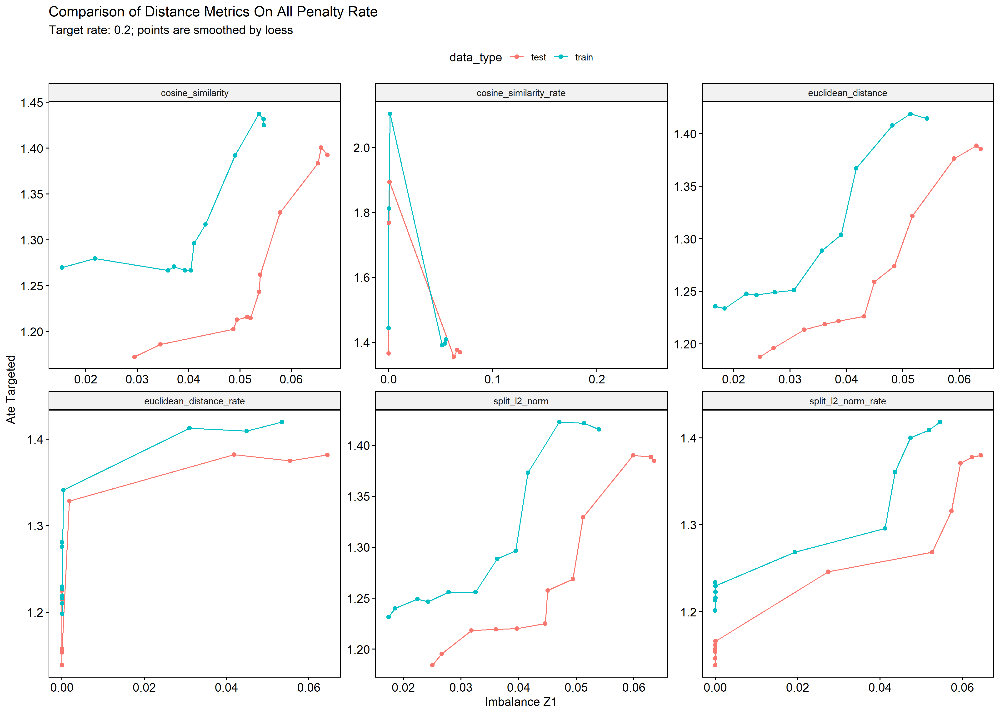
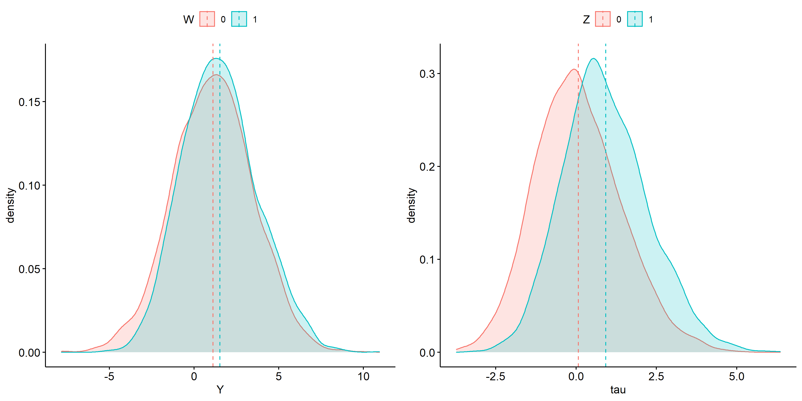

# generalized random forests <a href='https://grf-labs.github.io/grf/'></a>

Fork from [https://github.com/grf-labs/grf](https://github.com/grf-labs/grf)

## Build From Source:

Required R packages
```R
extra_pkgs = c(
  "data.table", 'Rcpp', 'Rcpp', 'RcppArmadillo', 'doParallel',
  'foreach', 'iterators',  'testthat', 'arrangements', 'ROI'
)

for (i in extra_pkgs) {
  install.packages(i)
}

# this is much faster than installing from source
install.packages('stringi', type = 'binary') 

```


Update Local Repo ( in the Repo root folder)

This method may speed up build time as not all files are recompiled. 
```
git fetch --all 
```
or Double click grf/r-package/grf/grf.Rproj --> Tools --> Version Control--> Pull Branches. 
You may need to correct some file conflicts.  

You may start new repo in a folder


Click Build --> Install and Restart


Clean Build and all files are compiled. 
```
git clone https://github.com/yu45020/grf
cd grf/r-package/grf
Use Rstudio to open it as a project. Or double click 'grf.Rproj'
Click Build --> Install and Restart
```

## Update to Upstream 2.0
The current master branch is developed on 1.2.0, and the RcppEigen is 0.3.3.7. Using the latest RcppEigen will cause error when building.

The branch `upstream_2_0` is developed on 2.0.0, and the RcppEigen is upgraded to 0.3.3.9. 

To build, type the following in terminal before building

```
git checkout upstream_2_0

```

There are some breaking changes when `sample.weights` is used in causal forest and regression forest. Please check the issue [here](https://github.com/grf-labs/grf/issues/796), [here](https://github.com/grf-labs/grf/pull/774), and the upstream [change log](https://github.com/grf-labs/grf/blob/master/releases/CHANGELOG.md#changed-breaking). The new changes take account into the size of a node when calculating sample weights, so that they have higher impact when node size is small.


```c++
// src/src/prediction/RegressionPredictionStrategy.cpp
PredictionValues RegressionPredictionStrategy::precompute_prediction_values(
{
    ...
    averages[OUTCOME] = sum / leaf_node.size(); // <- this cause small changes in prediction>
    averages[WEIGHT] = weight / leaf_node.size();
    ...
}


```


## Sample Usage

Dimensions:

X_train: [N, N_x]

Y_train: [N, 1]

Z_train: [N, N_z]


[Possible Distance Metrics](https://github.com/yu45020/grf/blob/master/r-package/grf/src/src/splitting/SplittingPenaltyMetric.cpp):


* `split_l2_norm_rate`: (default) left, right: l2 norm(colmean target weight)* penalty rate * node decrease
* `euclidean_distance_rate`: (left+right decrease) *  Euclidean distance (column mean target weight left, right ) * penalty rate
* `cosine_similarity_rate`: (left+right decrease) *  (1-cos_sim(column mean target weight left, right )) * penalty rate
* `split_l2_norm`: sum(left,right l2 norm(colmean target weight))* penalty rate
* `euclidean_distance`: Euclidean distance (column mean target weight left, right ) * penalty rate
* `cosine_similarity`: (1-cos_sim(column mean target weight left, right )) * penalty rate


```R
available_metrics = c("split_l2_norm_rate", "euclidean_distance_rate","cosine_similarity_rate", 
                      "split_l2_norm",  "euclidean_distance",  "cosine_similarity")


```

```R
# default setup
balanced_causal_forest <- function(X,
                          Y,
                          W,
                          Y.hat = NULL,
                          W.hat = NULL,
                          num.trees = 2000,
                          sample.weights = NULL,
                          target.weights = NULL,
                          target.weight.penalty = 0,
                          target.weight.bins.breaks = 256,
                          target.weight.standardize = TRUE,
                          target.weight.penalty.metric = "split_l2_norm_rate",
                          target.avg.weights = NULL, # array, if null, create internally
                          clusters = NULL,
                          equalize.cluster.weights = FALSE,
                          sample.fraction = 0.5,
                          mtry = min(ceiling(sqrt(ncol(X)) + 20), ncol(X)),
                          min.node.size = 5,
                          honesty = TRUE,
                          honesty.fraction = 0.5,
                          honesty.prune.leaves = TRUE,
                          alpha = 0.05,
                          imbalance.penalty = 0,
                          stabilize.splits = TRUE,
                          ci.group.size = 2,
                          tune.parameters = "none",
                          tune.num.trees = 200,
                          tune.num.reps = 50,
                          tune.num.draws = 1000,
                          compute.oob.predictions = TRUE,
                          orthog.boosting = FALSE,
                          num.threads = NULL,
                          seed = runif(1, 0, .Machine$integer.max)) {

    # :----  procedure ---:
    # 1. check input data
    # 2. get list of target weights: per column of X, bin X and get column-wise average of target weight
    # 3. (default): small forest to get Y_hat and W_hat, then Y-Y_hat, W - W_hat
    # 4. tune parameters via the same balanced_calsal_forest function
    #    a.tunnalbe parameters are in tune_balanced_causal_forest,
    #    b. prepare data and pass into tune_balanced_forest
    #       * random sample parameters from some distributions
    #       * fit small forest and get debiased.error
    #       * fit dice kriging: debiased.error ~ parameter values and find the smallest combinations (not necessary the tried version)
    #       * re-fit balanced_causal_forest by the best set and larger tress
    #       * return the best or default parameter set
    # 5. fit actual balanced_calsal_forest
    # +++++++++++++++++++++
    # to make penalty tunable, change tune_balance_causal_forest.R and tunning_balanced.R

    # target.avg.weights: array, [num target weight, observation, num x]
    # if null, create it internally
}    
```

## Comparison on Distance Metrics
Previous versions use split l2 norm rate for left and right splits. Cosine similarity is problematic when penalty rate is larger than 1.5 as all points are pushed to a node. 


ATE V.S. Imbalance Z1


## Targeting Policy
I write some functions for balanced sampling and greedy sampling. The script is [here](https://github.com/yu45020/grf/blob/master/r-package/grf/R/select_targets.R). 

## Highlights:
* Original package use symbolic links for all C++ codes, but Windows users may fail to build it from source. All C++ code locations are  re-arranged. 
* Add  target weight penalty in `regression_forest` and `causual forest`
* penalty is calculated as following:
   1. calculate average from all target weight, denoted as $V_{0}$;
   2. in the left node, denote number of samples as $N$,  denote average target weight from samples  as $V_{1}$; 
   3. add distribution penalty rate as $D * N*\frac{L_{2}Norm(V_{1}-V_{2})}{L_{2}Norm(V1) + L_{2}Norm(V2)}$.  
      - early splits usually have larger $N$ 
      - D is decrease in impurity
* Package version is changed to 1.2.1

## How Parameters Are Tuned: 
* generate a small number random number with uniform distribution on [0, 1] (`num.fit.reps`=50 * num parameters)
* generate values per parameter type (defined in `get_params_from_draw` in `tune.R` or check the code block below)
* use those parameter grid to fit a model with small size tree (`num.fit.trees`=200) and calculate de-biased error
* fit a Kriging model to predict expected error from a larger parameter grid (`num.optimize.reps`=1000 * num parameters)
* pick the parameter set by the lowest error and refit a tree to get actual error
* pick the best set from default parameter, user parameter, and tuned parameters by the lowest error value. 
* (The original package ignore user input parameters as it compares the tuned against default set)

### A Very Brief Explanation on Kriging model:
Suppose we want to do a parameter grid search. The computation burden becomes large when the number of parameters and values are large. 10 parameters and 100 values each will results in fitting 1000 models. To speed up the process, we first use a small size parameter grid and use the model error to fit a model that predicts the expected error for larger set of parameters. 

The Kriging model assumes the based on a set of parameter, the distribution of true model error conditioned on predicted error is normal, and the mean and variance depend on the parameter set. This method requires to center Y and X, so in `causal_forest` Y and W are centered before running causal analysis.

Reference:
>[Olivier Roustant, David Ginsbourger, Yves Deville.  DiceKriging, DiceOptim:  Two R packages forthe analysis of computer experiments by kriging-based metamodeling and optimization. 2010. ￿hal-00495766v2](https://hal.archives-ouvertes.fr/file/index/docid/499475/filename/DiceJSS.pdf)


## Definition of Parameter Grid

```R
default.parameters <- list(sample.fraction = 0.5,
                             mtry = min(ceiling(sqrt(ncol(X)) + 20), ncol(X)),
                             min.node.size = 5,
                             honesty.fraction = 0.5,
                             honesty.prune.leaves = TRUE,
                             alpha = 0.05,
                             imbalance.penalty = 0,
                             target.weight.penalty=0)
```

 ```R
  get_params_from_draw <- function(nrow.X, ncol.X, draws) {
    # draw is a vector of tunable parameter names
  if (is.vector(draws)) {
    draws <- rbind(c(draws))
  }
  n <- nrow(draws)
  vapply(colnames(draws), function(param) {
    if (param == "min.node.size") {
      return(floor(2^(draws[, param] * (log(nrow.X) / log(2) - 4))))
    } else if (param == "sample.fraction") {
      return(0.05 + 0.45 * draws[, param])
    } else if (param == "mtry") {
      return(ceiling(min(ncol.X, sqrt(ncol.X) + 20) * draws[, param]))
    } else if (param == "alpha") {
      return(draws[, param] / 4)
    } else if (param == "imbalance.penalty") {
      return(-log(draws[, param]))
    } else if (param == "honesty.fraction") {
      return(0.5 + (0.8 - 0.5) * draws[, param]) # honesty.fraction in U(0.5, 0.8)
    } else if (param == "honesty.prune.leaves") {
      return(ifelse(draws[, param] < 0.5, TRUE, FALSE))
    } else if (param=='target.weight.penalty') {
      return(pmin(gamma(draws[,param]), 100)) # [0, 100]
    }else {
      stop("Unrecognized parameter name provided: ", param)
    }
  }, FUN.VALUE = numeric(n))}
  ```

## Files Change Log
```
R/balanced_casual_forest.R
R/balanced_regression_forest.R
R/tuning_balanced.R
R/tune_casual_forest.R
R/tune_regression_forest.R
R/input_utilities.R
R/print.R
src/BalancedCausalForestBindings.cpp
src/BalancedRegressionForestBindings.cpp
src/forest/ForestTrainers.h
src/forest/ForestTrainers.cpp
src/splitting/factory/BalancedRegressionSplittingRuleFactory.h
src/splitting/factory/BalancedRegressionSplittingRuleFactory.cpp
src/splitting/factory/BalancedInstrumentalSplittingRulesFactory.h
src/splitting/factory/BalancedInstrumentalSplittingRulesFactory.cpp
src/splitting/BalancedRegressionSplittingRule.h
src/splitting/BalancedRegressionSplittingRule.cpp
src/splitting/BalancedInstrumentalSplittingRules.h
src/splitting/BalancedInstrumentalSplittingRules.cpp
src/commons/Data.cpp
src/commons/Data.h

```


--

[Sample usage](r-package/grf/tests/causual_forest_test.R)

### Results:



If Z is independent from X 


 
